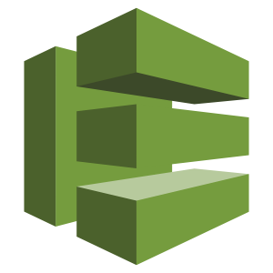

# Shared Demo Scripts
## Devops Engineering on AWS



### What is this?

This repository provides an export of various AWS demonstrations an instructor may leverage to deliver a course about Devops on AWS.

The demos in this repository are provide as is with **NO WARRANTIES** explicit or implied.  It is the consumers responsibility for costs & management of ANY & ALL provisioned resources in the consumers own AWS account(s) when using these demos.


### Whats in it?

The idea is that a student will create an AWS VPC & Cloud9 instance into their own AWS account, via the AWS Cloudformation templates in this repository.  They will then clone this repository into that Cloud9 instance to run each of the demos that may have been seen in a class delivery.

After cloning this repository within the Cloud9 instance, a student can simply `cd` into the relevant demo directory and follow the instructions in the 'demo.txt' or 'demo.md' file.

Here is the folder structure for each demo:

```
     demos /
           /##-some-demo-description/
                        demo.txt|md
                       /pre-reqs
                       /artifacts
                       /tests
```

- The Idea is that for each demo there will be a _demo folder_.
- The folder will be named `##-some-demo-description`
  - with the `##` being ~ to the module in the course to give you an idea where it fits in a story
  - and the `some-demo-description` being a short description of the actual demo within
- Within each _demo folder_ there will be:
  - _**a demo.txt or demo.md file**_: A simple file that you should be able to follow to repeat/perform a demo.  This is where you will start each demo.
  - _**a pre-reqs folder**_:  (optional) will contain any cfn & scripts that you may need to setup the demo environment for that demo.
  - _**an artifacts folder**_: (optional) will contain any yaml / json/ bins that you may use in running the demo(s).           
  - _**a tests folder**_: (optional) will contain some tests for the automation that will validate a demo is working on a regular schedule and post test results to the README.md.

#### Links

- [Time Table](doc/images/timetable.png)
- [Shared Doc Links](doc/Links.md)
- [Microservice & Cloudformation Repos](doc/Repos.md)

#### Demos (Coming Soon)

Demo Name     | Demo Link     | Last Automated Test Timestamp
--- | ---| ---
